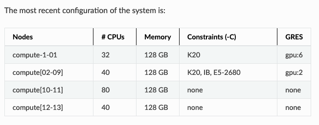
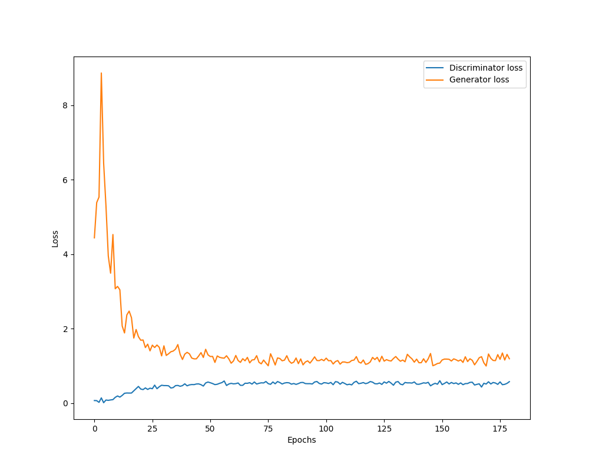
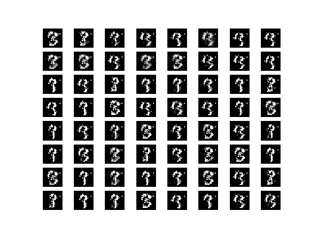

# DS504 GAN HW Submission
#### Name: Sam Longenbach
#### GitHub: https://github.com/longenbach/DS504_GAN_HW_Submission
#### Files:
- **generator_v6.h5** - *Pre-trained model's weights*
- **generator_v6.json** - *Pre-trained model's data hierarchy*
- **test.ipynb** - *Loads generator_v6 files for testing & generating outputs*
- **train_v6.py** - *Python code for training GAN*

## Generator:
For the generator I kept the design farily simple. It consistis of 4 layers with each layer having 256, 512, 1024, and 784 nodes respectively. In a few versions I scaled the real input images from -1 to 1 and had the activation of my last layer of the gerator be tanh. However, in the version I decided to submit scaled the real input images from 0 to 1 and used an sigmoid activation in my last layer  of the gerator. For the hidden layers I stuck with relu activations due to some diffculties I was having with importing leaky relu activations form Keras. In this case relu acivations seemed to be siffcient judging by the outputs of the trained model. 

```python
g = Sequential()
g.add(Dense(256,input_dim = z_dim,activation='relu'))
g.add(Dense(512,activation='relu'))
g.add(Dense(1024,activation='relu'))
g.add(Dense(784, activation='sigmoid')) 
g.compile(loss='binary_crossentropy', optimizer=adam, metrics=['accuracy'])
```

## Discrinimator:
For the discrinimator I made the design slighly more complex. It also consistis of 4 layers but also includes dropout after each layer. I arbitrarly set the dropout rate at %25 based on the linterture I read online. I did not play with this paramter too much but I did run a few versions before I added the dropout layers. In my model testing the dropout signfincally improved the outputs of the trained model.  

```python
d = Sequential()
d.add(Dense(1024, input_dim=784,activation='relu'))
d.add(Dropout(rate=0.25))
d.add(Dense(512,activation='relu'))
d.add(Dropout(rate=0.25))
d.add(Dense(256,activation='relu'))
d.add(Dropout(rate=0.25))
d.add(Dense(1, activation="sigmoid")) 
d.compile(loss='binary_crossentropy', optimizer=adam, metrics=['accuracy'])
```
## Training:
For training the model I used WPI's ACE server. The first versions of the model I ran on my mac because I didn't have acess the server. However, the later versions I trained the model on 1 Node using 36 CPUs. Although the server allows you to use two NVIDIA Tesla K20, I didn't have time to modfiy my code and it wasn't really necessay in this setting. Overall, I was able to train the model decribed below in about 45 minutes. 

*NumNodes=1 NumCPUs=36 NumTasks=35 CPUs/Task=1 ReqB:S:C:T=0:0:*:*TRES=cpu=36,mem=20G,node=1,billing=36,gres/gpu=2*


I ran the model for 180 epochs with a batch size of 125 images. Since I combined the training images and the testing images, I had the 70,000 Mnst images avaible. The batch count was number of images divided by the batchsize equal to 560. Meaning for each epoch the model was trained on 560 random image batches of size 125. For sake of simplcity, I kept track of the loss of the generator and discrinimator for the final image batch for each epoch. Below you can see the loss for the generator drastically fall after about 25 epochs remain farily flat from that point on.   
<!-- .element height="50%" width="50%" -->
 

 <!-- .element height="50%" width="50%" -->


